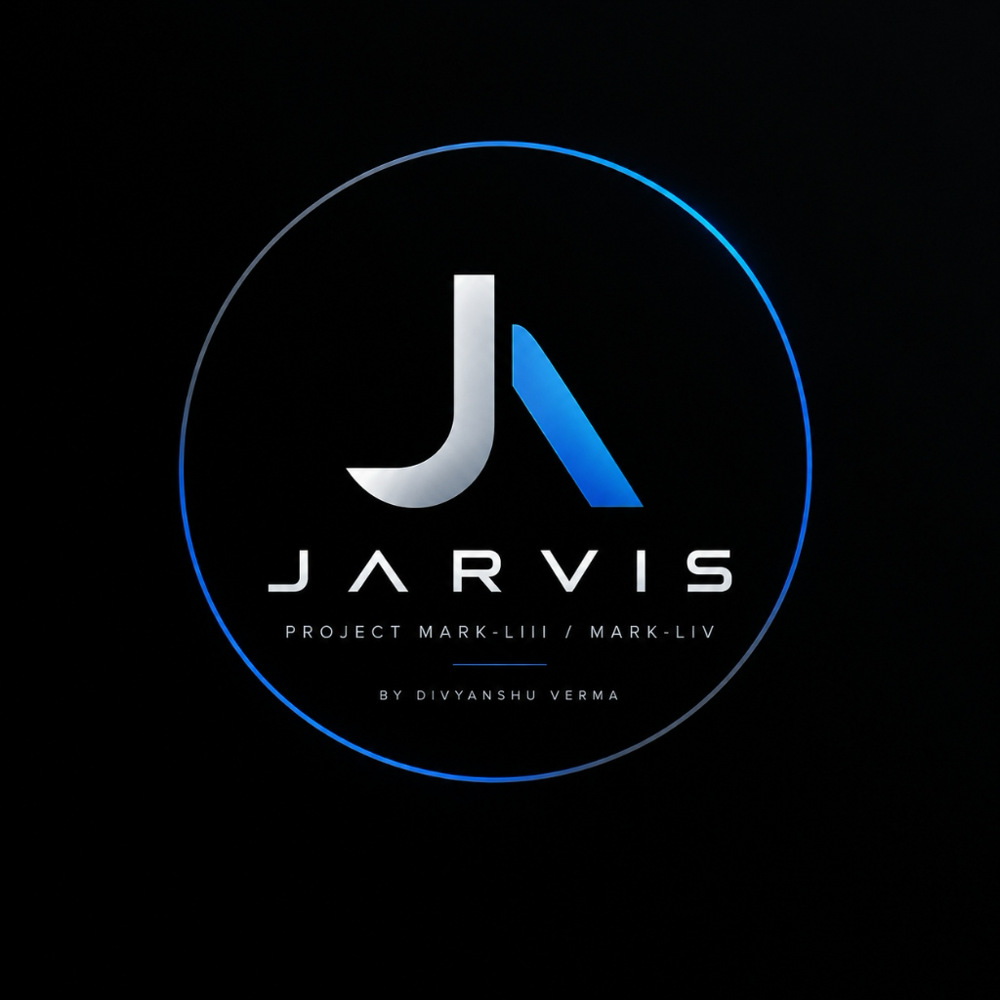

<p align="center">
  
</p>

<h1 align="center">⚡ J.A.R.V.I.S. (Mark 54) for macOS</h1>

<p align="center">
  <strong>Universal Autonomous Desktop AI Companion & Operating Assistant</strong><br>
  <em>Engineered from the ground up for seamless macOS integration, real-time multimodal voice duplex, 24/7 vision sentry, and zero-latency desktop automation.</em>
</p>

<p align="center">
  <a href="https://github.com/divyanshuvermaai-png/jarvis-mark-54-for-mac/releases/tag/v54.0.0"></a>
  <a href="https://www.youtube.com/@divyanshu_sovereign_agent"></a>
  
  
  
  <a href="LICENSE"></a>
</p>

---

## 👨‍💻 Meet the Creator — Divyanshu Verma

<p align="center">
  <strong>Built with passion by Divyanshu Verma — 17-Year-Old AI Developer & Systems Architect</strong>
</p>

> *"I designed J.A.R.V.I.S. Mark 54 to bridge the gap between static text LLMs and living, breathing desktop companions. An AI shouldn't just answer questions in a browser tab — it should see what you see, hear what you hear, and autonomously interact with your operating system to amplify your productivity."*  
> — **Divyanshu Verma**

- 🌟 **Age**: 17 Years Old
- 🚀 **Specialization**: Autonomous AI Agents, Multimodal Voice Duplex Systems, Vision Biometrics, System-Level OS Automation
- 📺 **Official YouTube Channel**: [@divyanshu_sovereign_agent](https://www.youtube.com/@divyanshu_sovereign_agent) *(Subscribe for live demos, build walkthroughs, and updates!)*
- 🌐 **Web Portfolio / Agent Hub**: [air-m5.lovable.app](https://air-m5.lovable.app)
- 🐙 **GitHub**: [@divyanshuvermaai-png](https://github.com/divyanshuvermaai-png)
- 📬 **Contact & Collaboration**: `divyanshuverma.ai@gmail.com`

---

## ⚡ 1. Overview

**J.A.R.V.I.S. (Mark 54)** is a sovereign desktop AI companion and intelligent operating assistant developed specifically for macOS. Unlike basic chat wrappers or web interfaces, Mark 54 operates as a native background desktop agent with full system awareness, real-time voice streaming, computer vision, and autonomous workflow execution.

> [!IMPORTANT]
> **Standalone macOS Application Package**  
> Mark 54 is distributed as a self-contained macOS application package with its complete Python 3.11 runtime and native dependencies pre-bundled directly into the DMG.  
> **Note:** Real-time conversational and vision features powered by Google Gemini require an active internet connection and a valid Google Gemini API key.

---

## ✨ 2. Core Features

- 🎙️ **Real-Time Voice Duplex**: Ultra-low-latency bidirectional conversational streaming powered by Google Gemini Live 2.0 WebSockets at 24 kHz. Talk naturally, interrupt mid-sentence, and converse hands-free.
- 👁️ **24/7 Biometric Security Sentry**: Intelligent camera monitoring that detects motion, recognizes user presence, and guards your workspace with automated desktop alerts.
- 🖥️ **Deep Screen Perception**: Real-time display capture and visual reasoning — ask JARVIS to debug code, inspect design mockups, or summarize documents on your monitor.
- ⚙️ **Autonomous OS Control**: Native ability to launch applications, search Safari, manage files, set smart reminders, and automate repetitive workflows via AppleScript.
- 🎨 **Floating Holographic HUD**: Hardware-accelerated Arc Reactor interface built with PyQt6, featuring fluid animations and multi-state status indicators.

---

## 💻 3. System Requirements & Compatibility

Grounded in our deep inspection of the Mach-O binary and embedded frameworks:

| Category | Status | Supported Configurations |
| :--- | :---: | :--- |
| **Officially Tested** | 🟢 | • macOS 14 (Sonoma), macOS 15 (Sequoia)<br>• Apple Silicon: M1, M2, M3, M4 (MacBook Air, MacBook Pro, Mac mini, Mac Studio) |
| **Supported** | 🟡 | • macOS 11 (Big Sur), macOS 12 (Monterey), macOS 13 (Ventura) on Apple Silicon |
| **Untested / Emulated** | ⚪ | • Intel x86_64 Macs (requires Rosetta 2 translation)<br>• Future macOS Developer Beta previews |

---

## 📥 4. Installation & Verification

### 1-Click Download

| File | Size | SHA-256 Checksum | Download |
| :--- | :---: | :--- | :---: |
| **`jarvis.dmg`** | **163 MB** | `a290cb6e34a37956c316969710b73495bc07a24b9722bd437dca1e643b72ec8a` | [**⬇️ Download jarvis.dmg**](https://github.com/divyanshuvermaai-png/jarvis-mark-54-for-mac/releases/download/v54.0.0/jarvis.dmg) |

### Cryptographic Checksum Verification
To verify that your download is genuine and untampered, open Terminal and run:
```bash
echo "a290cb6e34a37956c316969710b73495bc07a24b9722bd437dca1e643b72ec8a  ~/Downloads/jarvis.dmg" | shasum -a 256 -c
```
*Expected output:* `~/Downloads/jarvis.dmg: OK`

### Step-by-Step Install:
1. Double-click `jarvis.dmg` to mount the disk image.
2. Drag the **JARVIS** icon into your `/Applications` folder.
3. Eject the disk image in Finder.

---

## 🛡️ 5. macOS Permissions (Gatekeeper & TCC)

Because JARVIS Mark 54 is an independent developer build signed with deep ad-hoc entitlements, follow these steps on first launch:

### Gatekeeper & Quarantine Removal
1. Launch `JARVIS` from `/Applications` or Spotlight (`Cmd + Space`).
2. If macOS displays: *"JARVIS can't be opened because Apple cannot check it for malicious software"* or *"JARVIS is damaged and cannot be opened"*:
   - Open **System Settings > Privacy & Security**.
   - Scroll down to the **Security** section: click **"Open Anyway"** and enter your Mac password.
   - Click **"Open"** on the confirmation prompt. *(One-time setup only).*
   - **Alternative (One-line Terminal Fix)**: If macOS quarantine blocks launching downloaded apps, simply remove the quarantine attribute:
     ```bash
     xattr -cr /Applications/JARVIS.app
     ```

### Required TCC Permissions
Grant the following permissions in **System Settings > Privacy & Security** when prompted:
- 🎙️ **Microphone**: Required for real-time duplex voice conversations.
- 📷 **Camera**: Required for 24/7 Security Sentry and live object recognition.
- 🖥️ **Screen Recording**: Required for Deep Screen Perception and code debugging.
- ♿ **Accessibility**: Required for automated window manipulation and Apple Events.

*Read the full [**macOS Permissions Guide**](docs/PERMISSIONS.md) for detailed architectural justifications.*

---

## 🔑 6. Google Gemini API Configuration

JARVIS Mark 54 uses Google's latest Gemini Live 2.0 API. Free API keys are available in seconds:

1. Visit the official Google AI developer portal: 👉 **[https://aistudio.google.com/](https://aistudio.google.com/)**
2. Sign in with your standard Google account.
3. Click the blue **"Get API key"** button.
4. Click **"Create API key"** and select *"Create API key in new project"*.
5. Copy your key (starts with `AIzaSy...`).
6. Launch **JARVIS** and paste your key into the initial setup prompt.
7. Click **"Save & Connect"** or press `Enter`.

### API Key Storage & Security
- Your API key is stored locally in your Mac user profile at:
  ```bash
  ~/.config/jarvis/api_keys.json
  ```
- To secure this file against other local users, run:
  ```bash
  chmod 600 ~/.config/jarvis/api_keys.json
  ```
- *Note:* Native macOS Keychain integration is slated for the v54.1.0 update.

---

## 🔒 7. Privacy & Security Overview

- **Zero Telemetry**: No third-party analytics, user tracking, or advertising SDKs.
- **Direct-to-Google**: All AI network traffic flows strictly between your local Mac and Google Gemini API endpoints over encrypted HTTPS/WSS.
- **Human-in-the-Loop Safety**: JARVIS follows strict safeguards before executing potentially destructive actions (such as file deletion).
- For complete policies, read [**PRIVACY.md**](PRIVACY.md), [**SECURITY.md**](SECURITY.md), and [**Responsible Automation Policy**](docs/RESPONSIBLE_AUTOMATION.md).

---

## 🏛️ 8. Architecture Overview

J.A.R.V.I.S. is built on a 3-layer decoupled architecture:
1. **Perception Layer**: CoreAudio / PortAudio (24 kHz voice stream), OpenCV (camera sentry), MSS (display capture).
2. **Reasoning Layer**: Google Gemini Live 2.0 WebSockets duplex protocol, prompt fusion, and function call dispatch.
3. **Action Layer**: PyQt6 hardware-accelerated HUD, AppleScript system automation, local memory store.

*For full technical specifications, diagrams, and Mach-O details, read [**docs/ARCHITECTURE.md**](docs/ARCHITECTURE.md).*

---

## 🗣️ 9. Usage & Voice Commands

Speak naturally or click the floating Arc Reactor HUD:
- *"Hey Jarvis, what is on my schedule today?"*
- *"Jarvis, look at my screen and tell me what is causing this syntax error."*
- *"Open Safari and search for the latest autonomous AI agent papers."*
- *"Turn on Security Sentry mode."*
- *"Set a timer for 30 minutes and remind me to push to GitHub."*

---

## 🔧 10. Troubleshooting

- **Microphone not responding**: Check **System Settings > Privacy & Security > Microphone** and confirm `JARVIS` is enabled. In JARVIS settings, verify that your default audio input device is selected.
- **"Connection Failed" on API Key**: Ensure your Mac has an active internet connection and that your Gemini API key has Gemini Live / generateContent API permissions enabled on Google AI Studio.
- **HUD not appearing**: Press `Cmd + Tab` to see if JARVIS is running. If necessary, check crash logs in `~/Library/Logs/JARVIS/`.

---

## ⚠️ 11. Known Limitations

- **Internet Dependency**: AI voice and vision reasoning require an active internet connection to communicate with Google Gemini Live API.
- **External Multi-Monitor DPI**: Moving the Arc Reactor between a built-in Retina screen and an external monitor may show slight DPI scaling transitions (being addressed in v54.1).
- **Notarization**: Currently distributed with ad-hoc signing with hardened runtime; official Apple Developer ID notarization is planned.

---

## 🔮 12. Roadmap (v54.1.0)

- 🌐 **Multi-Monitor DPI Auto-Detection**: Seamless cross-display drag-and-drop scaling.
- 🗣️ **Custom Local Wake-Word Engine**: Choose *"Hey Jarvis"*, *"Friday"*, or custom offline wake phrases.
- 🔐 **Native macOS Keychain Integration**: Migrate API keys to Apple Keychain Services API.
- 🧩 **Plugin Store**: One-click action plugins for Spotify, Slack, VS Code, and Xcode.

---

## 📜 13. License & Third-Party Notices

- **License**: J.A.R.V.I.S. Mark 54 is licensed under the **JARVIS MARK 54 PROPRIETARY SOURCE-AVAILABLE SOFTWARE LICENSE Version 1.0 — 2026** (c) 2026 Divyanshu Verma. Read the full [**LICENSE**](LICENSE).
- **Commercial Licensing**: Commercial use, SaaS hosting, or paid redistribution requires written authorization. Contact `divyanshuverma.ai@gmail.com`.
- **Third-Party Libraries**: For upstream open-source licenses (Python, Qt, OpenCV, NumPy, PortAudio), see [**THIRD_PARTY_NOTICES.md**](THIRD_PARTY_NOTICES.md).

---

## 🤝 14. Contributing & Community

We welcome issue reports and documentation feedback! Please read [**CONTRIBUTING.md**](CONTRIBUTING.md) and use our [Issue Templates](.github/ISSUE_TEMPLATE/).

---

<p align="center">
  <strong>⚡ J.A.R.V.I.S. Mark 54 — Redefining Autonomous Desktop AI</strong><br>
  <em>Designed, Engineered, and Maintained by Divyanshu Verma (17-Year-Old AI Developer)</em><br>
  <a href="https://www.youtube.com/@divyanshu_sovereign_agent"><strong>📺 Subscribe on YouTube</strong></a> • <a href="https://air-m5.lovable.app"><strong>🌐 Visit Portfolio</strong></a>
</p>
